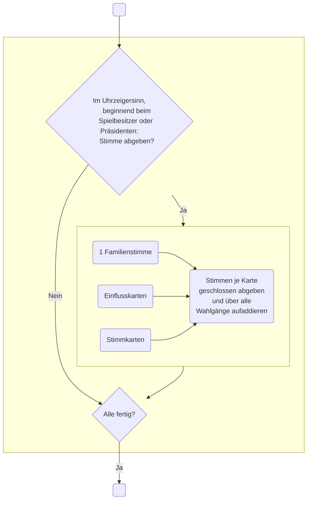
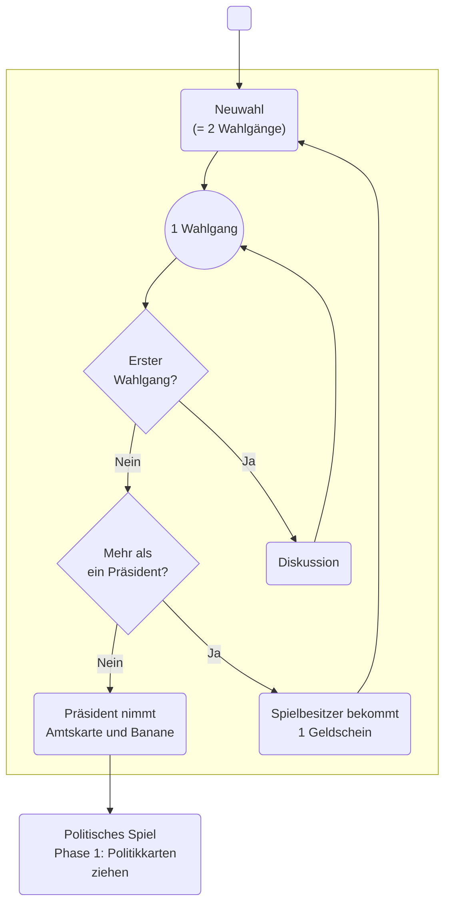
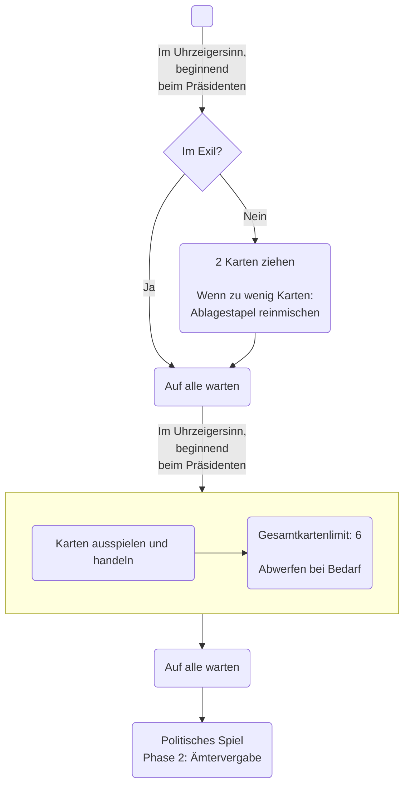

# Junta

## 1 Wahlgang

## Präsidentschaftswahl

## Politisches Spiel

### Phase 1: Politikkarten ziehen

### Phase 2: Ämtervergabe

Präsident vergibt die Ämter.

Regeln:

-   Präsident darf kein weiteres Amt haben.
-   Jede Familie bekommt 1-2 Ämter
-   Keine Familie darf 2 Armeebrigadegeneräle bekommen.

### Phase 3: Entwicklungshilfe einziehen

Der Präsident zieht verdeckt 8 Geldscheine vom Entwicklungshilfestapel zu seinem Handgeld.

### Phase 4: Haushalt

1.  Präsident schlägt Haushalt vor:
    1.  Handgeld des Präsidenten wird nach Belieben verteilt.
        Kein Tausch mit Spielern erlaubt, d.h. es dürfen nur Geldscheine vom Präsidenten zu den Spielern wandern, nicht umgekehrt.
    1.  Pro Spieler muss

        -   entweder der verteilte Geldbeträge
        -   oder ein Geldbetrag kleiner dem tatsächlich verteilten Geldbetrag

        laut angesagt werden.
1.  Über Haushalt wird [per Wahlgang](#1-wahlgang) abgestimmt.
    -   Bei Annahme: Weiter mit [Phase 5: Aufentahltsort wählen](#phase-5-aufenthaltsort-wählen)
    -   Bei Ablehnung: Weiter in dieser Liste
1.  Marker setzen: **Instabile Lage**
1.  **Minister für Innere Sicherheit** kann Haushalt mit Gewalt durchsetzen.

    Bei Gewalt:
    -   Alle Einheiten der **Polizei** in das Gebiet **Parlament** setzen.
    -   Marker setzen: Bank hat **Mittagspause**

    Bei Verzicht auf Gewalt:
    -   Präsident behält alle Geldscheine für sich.
    -   Marker setzen: Bank hat **Bankferien**
1.  Weiter mit [Phase 5: Aufenthaltsort wählen](#phase-5-aufenthaltsort-wählen)

### Phase 5: Aufenthaltsort wählen

1.  Jeder Spieler wählt geheim einen Ort oder das Exil.

    Bei Exil:

    1 Kontrollmarke auf Botschaft legen.
    -   Spieler ist damit quasi aus dem Spiel.
    -   Präsident ins Exil bedeutet sofortige Neuwahlen.
1.  Weiter mit [Phase 6: Attentate](#phase-6-attentate)

### Phase 6: Attentate

Attentate sind nur mit Attentäterkarten möglich.
Außnnahme: **Minister für Innere Sicherheit** hat 1 freies Attentat wegen der Kontrolle über die **Geheimpolizei**.

**Minister für Innere Sicherheit** beginnt, dann im Uhrzeigersinn weiter.

Pro Spieler:

1.  Alle Attentate ankündigen.
1.  Je Attentat: Aufenthaltsort von Ziel raten.
1.  Wird durch den **Minister für Innere Sicherheit** das freie Attentat in der Bank versucht, so wird Marke auf **Attentat** auf **Kein Attentat** gesetzt.
    Dieses freie Attentat darf nur jede 2. Runde in der Bank versucht werden.

Wenn alle Attentate angekündigt wurden:

1.  Aufenthaltsorte bekanntgeben.
1.  Attentate in der Reihenfolge durchführen.
1.  Bei Tod:
    -   Auftraggeber des Attentäters bekommt Handgeld des Ermordeten.
        Ist dieser auch schon tot, kommt das Handgeld aus dem Spiel.
    -   Marke **Stabil** wird **Instabil**.
    -   Cousin des Präsidenten (= Spieler mit Präsidentenamt) bekommt maximal 1 Amt des Verstorbenen.

Wurde der Präsident ermordet, gibt es nun Neuwahlen.
Wurden alle Spieler diese Runde ermordet, gewinnt niemand das Spiel.

### Phase 7: Bankgeschäfte

Präsident beginnt.

Möglichkeiten, wenn Bank offen ist:

-   Geld einzahlen.
-   Geld abheben.

### Phase 8: Putsch

Jeder Spieler, bis auf den Präsidenten, darf einen Putsch auslösen, falls eine der folgenden Aussagen zutrifft:

-   Marke auf **Instabil**
-   **Hauptquartier** als Ort gewählt wurde

Ein Putsch wird begonnen durch:

-   Eine Karte Putschereignis
-   Einen Spieler, der seine Einheiten bewegt
-   Ansage des **Admirals der Marine**, mit dem Kanonenboot zu schießen
-   Ansage des **Kommandeurs der Luftwaffe**, mit einem Luftangriff zu schießen

Wer Putsch beginnt, wird **Rebellenführer**.
Das Politische Spiel geht dann in das [Putschspiel](#putschspiel) über.

Ohne Putsch geht es weiter mit [Phase 9: Rundenende](#phase-9-rundenende).

### Phase 9: Rundenende

1.  Falls Bank auf **Mittagspause** war, ist sie nun wieder geöffnet.
1.  Spieler dürfen Bankgeschäfte tätigen, beginnend beim Präsidenten.
1.  **Instabil** wird wieder **Stabil**.
1.  Bank hat nun auch bei wieder **Bankferien** wieder geöffnet.
1.  Entweder heimkehren:

    -   1 beliebiger Geldschein aus Handgeld abwerfen.
    -   Wenn kein Handgeld, dann 1 Geldschein von Schweizer Bankkonto abwerfen.

    Oder im Exil bleiben:

    -   1 Geldschein von Schweizer Bankkonto abwerfen, falls vorhanden.

Weiter mit [Phase 1: Politikkarten ziehen](#phase-1-politikkarten-ziehen)

## Putschspiel

Wer die Banane hat, darf beginnen.
Der Rebellenführer bekommt allerdings die Banane.
Daher darf er beginnen, dann geht es im Uhrzeigersinn weiter.
Erst Rebellenphase, dann 6 weitere, vollständige Putschphasen.

Ziel ist die mehrheitliche Kontrolle der roten Gebiete.
Putschspiel darf bei Einstimmigkeit abgebrochen werden.

### **Rebellenphase**

Zusätzlich zu normaler Putschphase gilt:

-   Abschnitt Bewegung
    -   Wer in der **Rebellenphase** bewegt oder schießt, gilt als **Rebell**.
        Präsident darf also weder bewegen noch zurückschießen.

        Ausnahme:

        **Minister für Innere Sicherheit** darf **Polizei** in der **Rebellenphase** bewegen, falls passende Politikkarten in der **Rebellenphase** verwendet wurden (z. B. aufständische Studenten).
        Einheiten dürfen dann auf die entsprechenden Felder mit den Aufständischen bewegt werden.
-   Wer auf Palastgarde schießt, wird zum Rebell.

### Normale Putschphasen

1.  Abschnitt Bewegung
    -   Politikkarten dürfen gespielt werden.
    -   Bewegung ist nur für die Einheiten eines Gebietes erlaubt.

        Ausnahmen:
        -   Präsident darf diese Bewegung 1x je Amt.
        -   Der Hubschrauber darf, zusätzlich zu obiger Bewegung, 2 Felder bewegen.
        -   Initiale Bewegung von Spezialeinheiten, zB Fallschirmjäger oder Marine-Infanterie.
    -   Einheitenkontrolle darf mit Marken abgegeben werden.
        Jede Einheit darf nur einmal bewegt werden.
1.  Abschnitt Kampf
    -   Politikkarten dürfen nicht gespielt werden.
    -   Rebellenführer bestimmt Reihenfolge der Gefechtsgebiete, aber jedes Gebiet dann als Ganzes.
    -   Gefechte müssen nicht stattfinden, außer bei Palastgarde.
    -   Botschaft ist friedliches Gebiet.

    Abfolge:

    1.  Beschuss durch Kanonenboot und Luftangriffe, Uhrzeigersinn vom Rebellenführer aus bestimmt Reihenfolge
    1.  Schusswechsel (je 3) in jedem angesagten Gebiet
    1.  Rückzug

        -   Rückzug ist verpflichtent für Spieler mit mehr Einheitenverlust.
        -   Der Spieler mit geringstem Einheitenverlust zieht sich nicht zurück und kann Rückzug anderer Einheiten verbieten.
            Gleichstand impliziert Verbot von Rückzug.
        -   Bei Rückzug in ein Gebiet müssen dort vorhandene Spieler einstimmig zustimmen.
        -   Rückzug unmöglich, dann werden Einheiten entfernt.
        -   Einheiten auf Flucht sind in dieser Phase geschützt.
1.  Banane wandert 1 Spieler weiter.

### Ende des Putsches

Putschspiel darf bei Einstimmigkeit abgebrochen werden.

Rebellenführer beginnt, dann im Uhrzeigersinn.

1.  Entscheidung, ob pro Präsident oder pro Rebellen.
1.  Kontrollierte Gebiete zählen.
    Gebiet gehört Rebellen, wenn das Gebiet nicht leer ist und **alle** Einheiten dort rebellentreu sind.

Bei Sieg des Präsidenten:

1.  Ein Rebell darf an das Erschießungskommando übergeben werden.
    Präsident bekommt das Handgeld.

Bei Sieg der Rebellen:

1.  Rebellen bilden Junta aus 100 % rebellentreuen Leuten.
1.  Neuwahl nur unter dieser Junta.

    -   Nur 1 Stimme pro Familie.
    -   Bei Gleichstand entscheidet Rebellenführer.
1.  Ein beliebiger Spieler darf an das Erschießungskommando übergeben werden.
    Neuer Präsident bekommt das Handgeld.

Weiter mit [Phase 9: Rundenende](#phase-9-rundenende)
